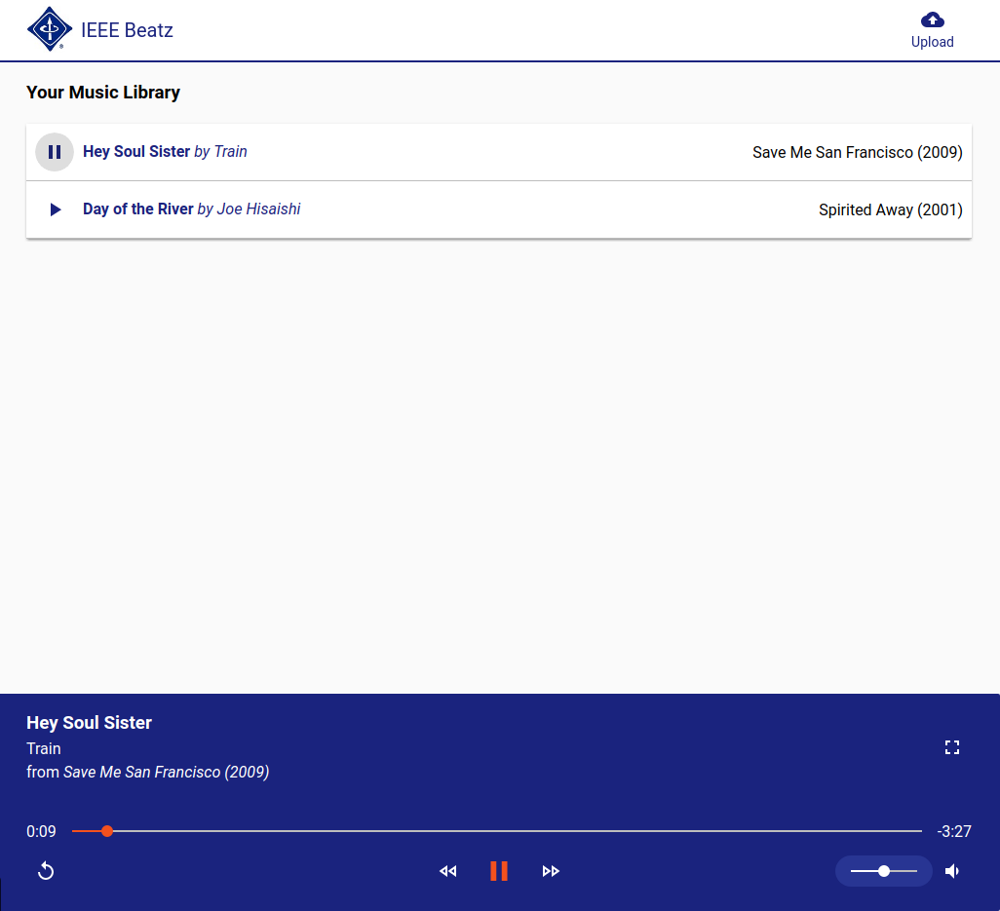

# Web Development Workshop: IEEE Beatz
Your music, your way.

## Requirements
You'll need a few things to get started.

1. A laptop with an internet connection.
2. Something to eat, because learning is best done of a full stomach.

## What You Will Learn

Frankly, a lot! We don't expect you to complete this project in two hours. However, by the end of this project, you should learn enough to at least know what to Google. Overall, we will be learning how to develop a *Single-Page Web Application (SPA)* using modern *front-end* and *back-end* technologies.

#### Front-end

The *front-end* of a web application is also called the *User Interface (UI)* or the *client side*. Every User Interface requires three things:

- *HTML*: The structure of the web page (this is a header, this is text, etc.)
- *CSS*: The style of the web page (colors, borders, etc.)
- *JavaScript (JS)*: The code running a web page (what happens when you click something, etc.)

Additionally, a *UI framework* allows web developers to make better, more formal apps. The framework we will be using is [Google Polymer](https://www.polymer-project.org/) version 2.0.

The most important part of a framework is its ability to create *components*. For example, if you're making a blog and want your name to appear in the header of each page, we can use a component to place the header on each page, instead of having to copy and paste over and over again.

#### Back-end

The *back-end* of a web application is also called the *server-side*. Although Java, Python, and many other languages support back-end web application development, we will be using [NodeJS](https://nodejs.org/en/). *NodeJS* is a fast and powerful engine for web application development and (most importantly) has a huge community backing, allowing almost instant implementation of common functions.

To assist out development, we will also be using *ExpressJS*, a library for NodeJS that allows users to create powerful *Application Programming Interfaces, or APIs*. We'll go over APIs and *REST requests* during this event.

<!-- ## Terminology

Any web developer will tell you: there's a lot of terminology to learn. Any important terms that we'll use will be in *italics*. Important notes will be in **bold**. -->

## References

Keep these handy. They contain the documentation required to understand how the project works.

- [Google](http://bfy.tw/DucP): It's really useful. Prefix your searches with the language you're using, such as "html", "css", "js", or "nodejs"
- [Google Polymer Documentation](https://www.polymer-project.org/2.0/docs/devguide/feature-overview): It's a little dense sometimes, but if you're looking for something specific related to Polymer it's probably here.
- [Web Components](https://webcomponents.org): Contains a list of Polymer-compatible elements
- [Mozilla Developer Network (HTML/CSS/JS Documentation)](https://developer.mozilla.org/en-US/): An excellent guide for specific documentation related to the web
- [NodeJS Documentation](https://nodejs.org/dist/latest-v6.x/docs/api/): The official NodeJS documentation, containing all functions that NodeJS can provide
- [StackOverflow](https://stackoverflow.com): If you can't find what you want anywhere else... look here

## Setup
Let's get started! Make sure you meet the Requirements above first then continue below.

1. Install NodeJS from https://nodejs.org/en/. On the bottom of this page are two releases of NodeJS: LTS and Current. Please download the LTS version (6.x as of writing).
2. **After NodeJS is installed**, open up a terminal window ("Command Prompt" in Windows, "Terminal" on Mac/Linux).
3. To verify NodeJS is installed, type `node -v` to check the version.
4. Run `npm install -g polymer-cli bower` (use `sudo npm install -g polymer-cli bower` if you're on a Mac).
5. Download this project from GitHub and extract it into a directory on your desktop (or somewhere you like).
6. Go inside that directory (using the `cd` command). Make sure you are inside the directory with this `README.md`.
7. Now `cd ui` (go into the `ui` folder). Run `bower install` inside this folder.
8. Now `cd ../api` (go back one then into `api` folder). Run `npm install` inside the `api` folder.

## Running the App
You'll need two terminal windows to run the app.

1. Run `node app.js` inside the `api` folder.
2. Run `polymer serve --port 8000` inide the `ui` folder.

Then, go to `localhost:8000` in your web browser. You should see a very basic site!

To verify the API is working, go to `localhost:5000/api` in your web browser.
